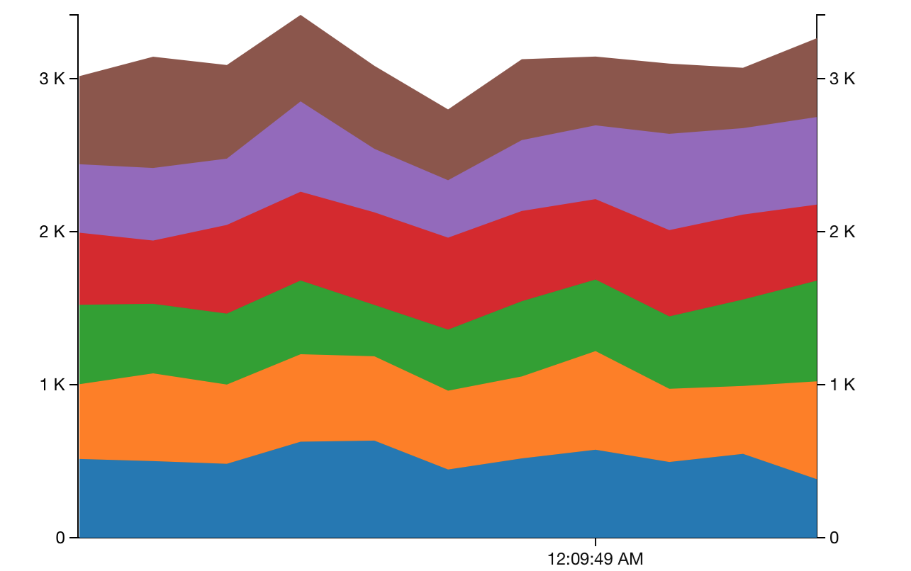

# kafka + spark streaming

[](https://travis-ci.org/trK54Ylmz/kafka-spark-streaming-example)

This is a demo of Kafka and Spark Streaming example.

### Prerequisites

Java 1.8 or newer version required because lambda expression used for few cases

1. Java >= 1.8 (Oracle JDK has been tested)
2. Maven >= 3
3. Apache Spark >= 2.0.2
4. Kafka >= 0.10.1.0

### Installation

First of all, clone the git repository,

```bash
$ git clone git@github.com:ieranik/spark_kafka_stream.git
```

after you need to use Maven for creating uber jar files,

```bash
$ mvn clean package -DskipTests
```

until that moment we had created jar files and now we'll install Kafka and MySQL,

```bash
$ wget http://www-us.apache.org/dist/kafka/0.10.1.0/kafka_2.11-0.10.1.0.tgz
$ # or wget http://www-eu.apache.org/dist/kafka/0.10.1.0/kafka_2.11-0.10.1.0.tgz
$ tar -xf kafka_2.11-0.10.1.0.tgz
$ cd kafka_2.11-0.10.1.0
$ nohup ./bin/zookeeper-server-start.sh ./config/zookeeper.properties > /tmp/kafka-zookeeper.out 2>&1 &
$ nohup ./bin/kafka-server-start.sh ./config/server.properties > /tmp/kafka-server.out 2>&1 &
```

Kafka is ready we can continue to install MySQL,

```bash
$ sudo apt-get install mysql-server # for Ubuntu, Debian
$ sudo yum install mysql-server && sudo systemctl start mysqld # for CentOS, RHEL
$ brew install mysql && mysql.server restart # for macOS
```

and finally create MySQL database and table,

```sql
CREATE DATABASE IF NOT EXISTS dashboard_test;

USE dashboard_test;

CREATE TABLE IF NOT EXISTS events (
 market VARCHAR(24) NOT NULL DEFAULT '',
 rate FLOAT DEFAULT NULL,
 dt DATETIME NOT NULL,
 PRIMARY KEY (market, dt)
)
ENGINE=InnoDB DEFAULT CHARSET=utf8 COLLATE=utf8_bin;
```

### Usage

1 - Start the Spark streaming service and it'll process events from Kafka topic to MySQL,

```bash
$ cd kafka-spark-streaming-example
$ java -Dconfig=./config/common.conf -jar streaming/target/spark-streaming-0.1.jar
```

2 - Start the Kafka producer and it'll write events to Kafka topic,

```bash
$ java -Dconfig=./config/common.conf -jar producer/target/kafka-producer-0.1.jar
```

3 - Start the web server so you can see the dashboard

```bash
$ java -Dconfig=./config/common.conf -jar web/target/web-0.1.jar
```

4 - If everything look fine, please enter the dashboard address,

```bash
open http://localhost:8080 # default value : 8080
```


